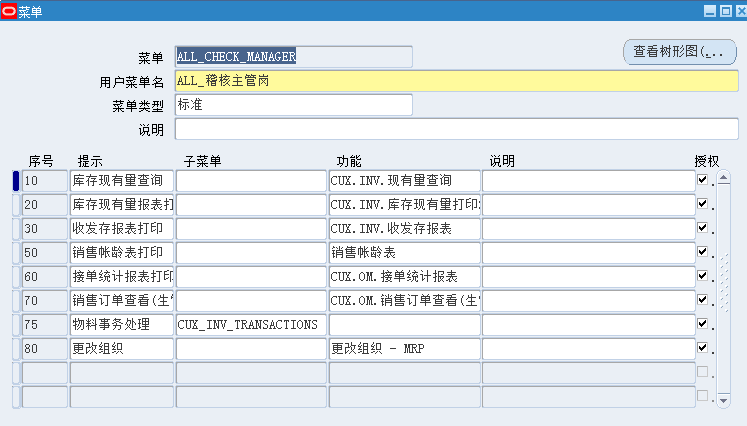
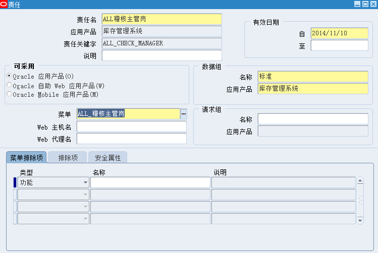
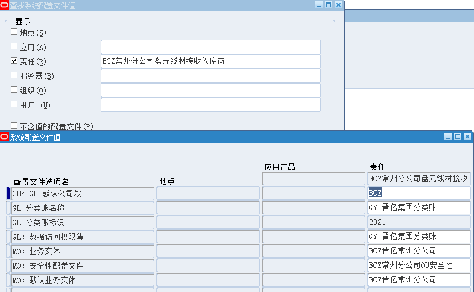
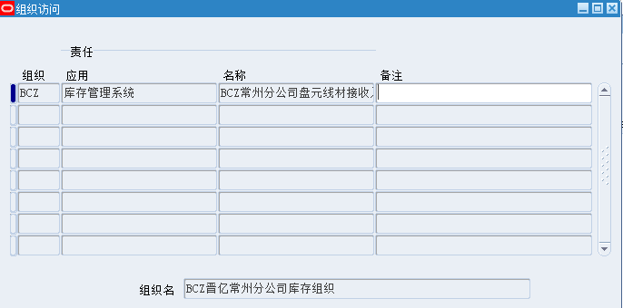

#### 新建岗位

1.进入系统管理员选择菜单填写相关信息

2.系统管理员下打开职责菜单新建

3.系统配置文件
* CUX_GL_默认公司段：BCZ
* GL 分类账名称：GY_晋亿集团分类账
* GL 分类账标识：2021
* GL：数据访问权限集：GY_晋亿集团分类账
* MO：业务实体：BCZ晋亿常州分公司
* MO：安全性配置文件：BCZ常州分公司OU安全性
* MO：默认业务实体：BCZ晋亿常州分公司

4.组织访问

